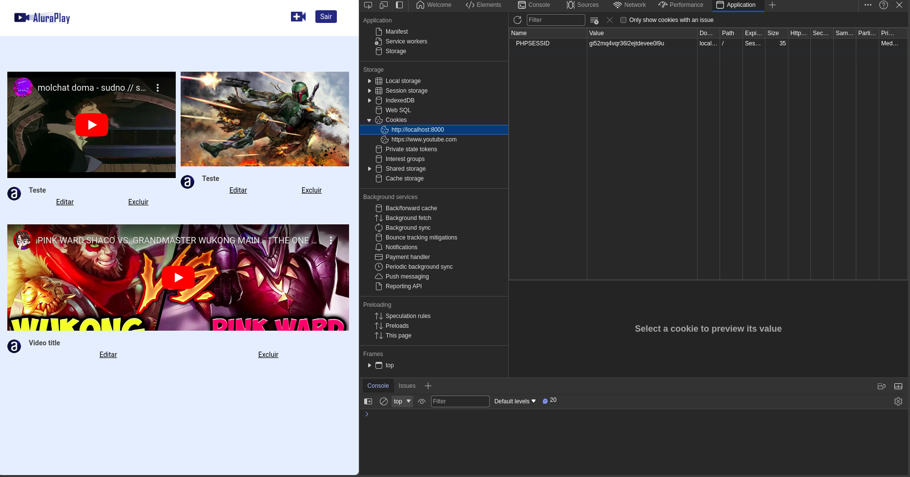
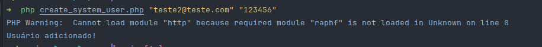
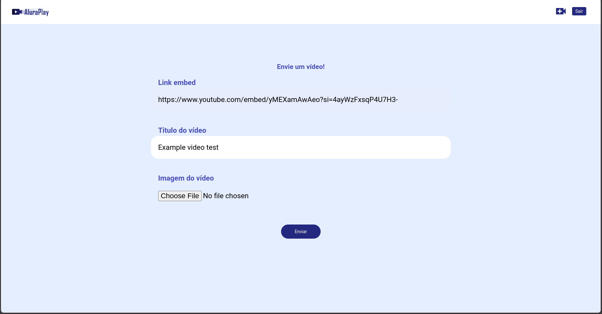
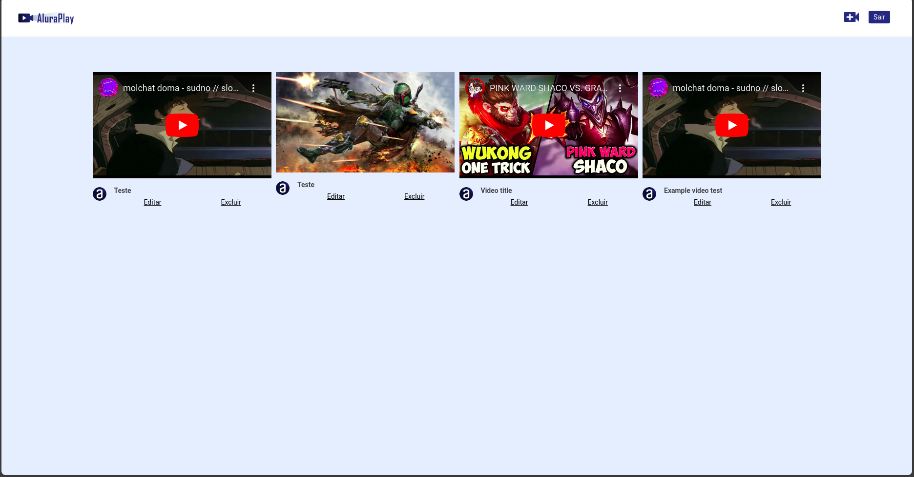
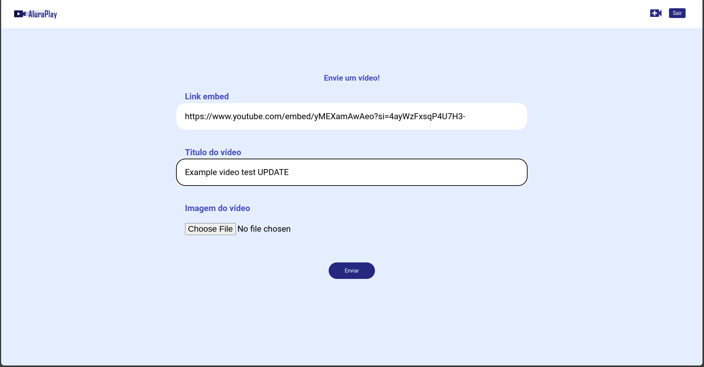
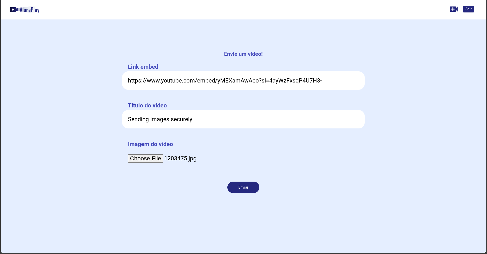
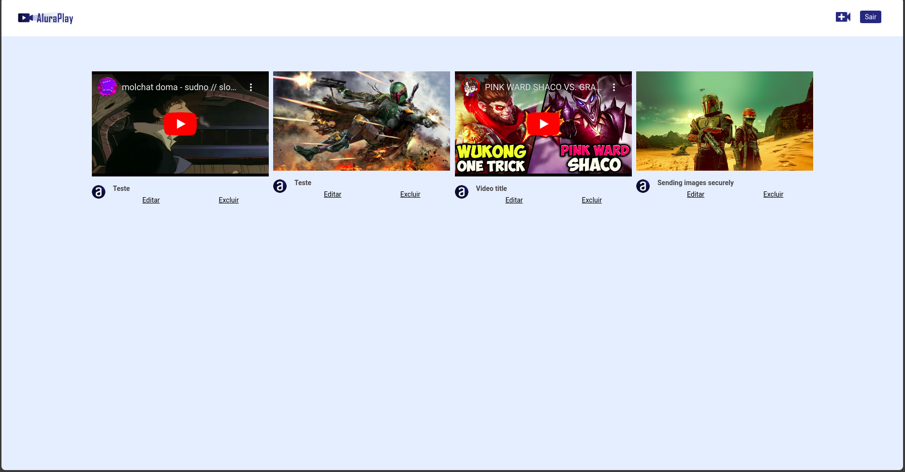
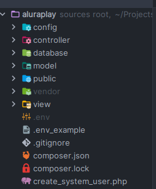

A PHP project built with the MVC architecture, made from scratch without a framework

# Final project

## User auth:

- Session with cookie

- Create user in terminal

- Unauthenticated users are sent to /login

## Add, Update and Remove video

- Update

## Sending images securely

## Project folder structure

